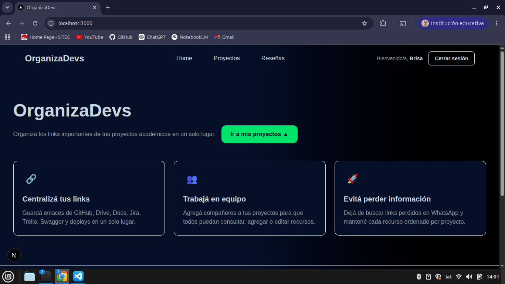
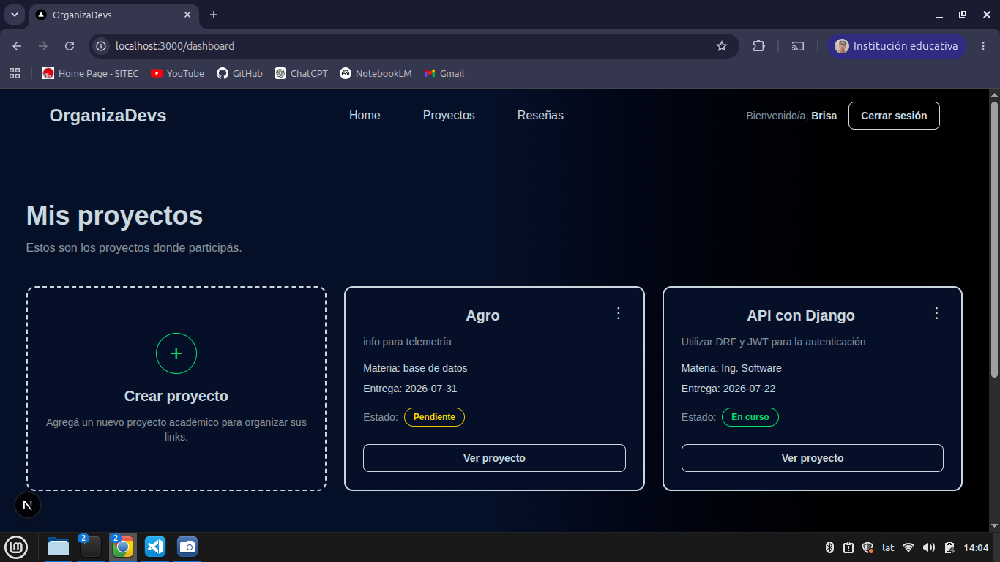
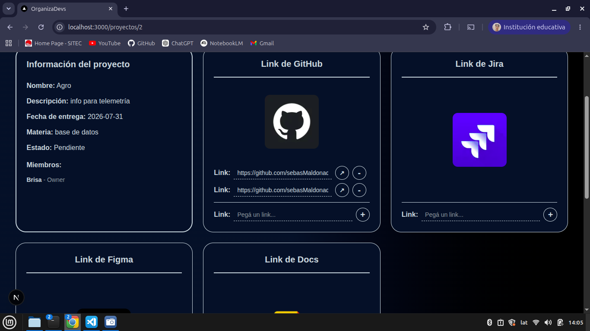

# OrganizaDevs

OrganizaDevs es una aplicación web pensada para estudiantes y equipos que trabajan en proyectos académicos grupales y necesitan centralizar todos sus links importantes en un solo lugar.

La idea principal es evitar que recursos como repositorios de GitHub, documentos, diseños, tableros de tareas o enlaces de entrega se pierdan entre mensajes de WhatsApp, chats o carpetas desordenadas.

---

## Funcionalidades principales

- Registro e inicio de sesión de usuarios.
- Autenticación mediante JWT.
- Dashboard con los proyectos donde participa el usuario.
- Creación de proyectos académicos.
- Agregado de integrantes al crear un proyecto.
- Fecha de entrega del proyecto.
- Edición y eliminación de proyectos.
- Vista detallada de cada proyecto.
- Organización de links por categorías.
- Agregar, editar, abrir y eliminar links.
- Apertura de enlaces en una nueva pestaña.
- Interfaz responsive.
- Footer con información de contacto.

---

## Tecnologías utilizadas

### Frontend

- Next.js
- React
- JavaScript
- Tailwind CSS
- React Icons
- next/font

### Backend

- Django
- Django REST Framework
- Simple JWT
- PostgreSQL
- CORS Headers

---

## Capturas

### Home

### Dashboard

### Vista de proyecto

---

## Licencia

Este proyecto fue desarrollado con fines educativos y como parte de un portfolio personal.